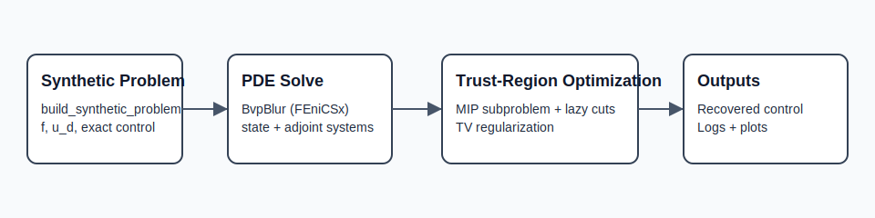
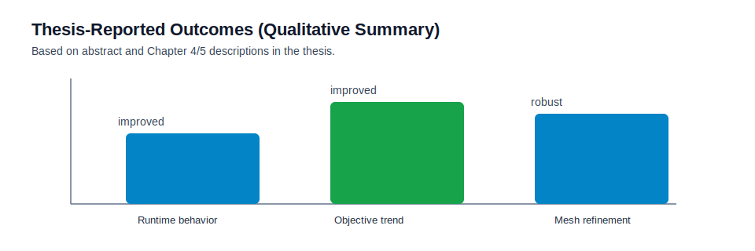

# TV-Regularized Integer Optimal Control (FEniCSx + Gurobi)

This repository contains the code base for a master-thesis project on integer-valued PDE-constrained optimization with total-variation (TV) regularization.



## Background

The project studies binary/integer control problems in function spaces where classical weak compactness fails for integer-valued feasible sets. TV regularization is used to recover compactness and avoid oscillatory controls.

From the thesis abstract and chapter structure, the implementation focus is:

- Sequential trust-region optimization in a mixed-integer setting.
- Outer-approximation style handling of TV via lazy constraints.
- Coarse-grid and patch/domain-decomposition ideas for better practical runtime.

## What This Code Implements

- Synthetic benchmark construction (`synthetic_problem.py`).
- FEM state/adjoint assembly and solves on triangular meshes (`bvp_blur.py`).
- Tracking-type objective and adjoint gradient (`opt_blur.py`).
- TV operators and coarse/fine grid mappings (`opt_tv_base.py`, `tv_coarse_handler.py`).
- Trust-region outer loop (`trust_region_solver.py`).
- MIP trust-region subproblem with lazy cuts (`mip_subproblem.py`).
- RT0 dual TV subproblem (`rt0_dual_solver.py`).

## Results Snapshot (Thesis-Grounded)



Reported in the thesis numerical experiments:

- Runtime behavior improved with the proposed implementation enhancements.
- Objective values improved across successive mesh refinements.
- Two experiment families were used:
  - exact-solution validation,
  - parameter-sensitivity analysis.

Key context:

- These statements are qualitative summaries from the thesis text.
- Exact quantitative numbers should be taken from Chapter 4 tables/figures in the thesis PDF.

## Project Structure

- `run_experiment.py`: primary entrypoint.
- `trust_region_solver.py`, `trust_region_subproblem.py`: optimization flow.
- `mip_subproblem.py`, `rt0_dual_solver.py`: subproblem solvers.
- `synthetic_problem.py`: symbolic benchmark data generation.
- `tests/`: lightweight unit tests for non-heavy logic.

Legacy module names are still available as wrappers for compatibility (`go4it.py`, `trust_region_cb.py`, etc.).

## Installation

### Option A: pip + requirements

```bash
python -m pip install -r requirements.txt
```

### Option B: conda

```bash
conda env create -f environment.yml
conda activate tv-pde-inverse-problem
```

## Reproducibility

Run the full quick reproduction pipeline:

```bash
./reproduce.sh
```

Or via make:

```bash
make reproduce
```

## Quality Checks

```bash
python -m pip install ".[dev]"
make ci
```

## Limitations and Known Issues

- `dolfinx` + `petsc4py` + MPI setup can be platform-sensitive.
- `gurobipy` requires a valid Gurobi installation/license.
- Full experiment runs can be computationally expensive for fine meshes.
- The included unit tests are intentionally lightweight and do not execute full FEM/MIP end-to-end solves.

## Citation

If you use this code, please cite:

- this software repository (`CITATION.cff`), and
- the associated master thesis (`master_thesis_Lars_Moesezahl .pdf`).

## License

MIT License (see `LICENSE`).
